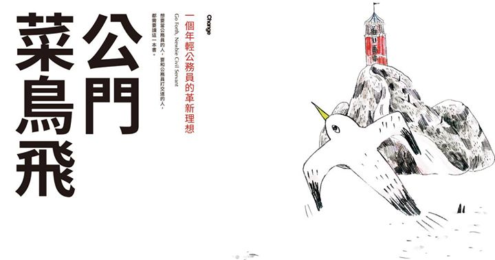

```{r setup, include=FALSE}
knitr::opts_chunk$set(echo = FALSE)
```

## 公務人員：軍、公、教

<center>
{width=50%}

金門的工作，有**40%**是軍公教從業人員
</center>

## 給林全院長的一封信——公務員也想實踐夢想

## 公務人員：

## 案例1

還自問自答「公務員有很多假放不完，勞工有很多班加不完；公務員有家累不能加班，勞工有家累但是要加班；私人企業花半個人的錢，雇用一個勞工，做2個人的事；國營企業花2個人的錢，雇一個人，做半個人的事」。

最後一句更，嗆道「政府花4個人的錢，雇用一個人，馬的不做事，還給民眾添亂。」文章才PO上3小時，就有近兩千多人按讚！

## 案例1

> 跟在臺灣一樣，知識分子這個群體經常被懷疑有親共的傾向。在金門，唯一的知識分子是老師。1940年代晚期，王芳茗接受以前同學的邀請，從家鄉到金門縱學教書。1949年10月，廈門陷落，王芳茗跟許多人一樣，隔著海峽和家人斷了聯繫。⋯（略）⋯但在1968年9月的某一天，王芳茗被縣級的金門調查局情治人員**帶走**。⋯（略）⋯王芳茗否認這項指控⋯（略）⋯在拷問下，他「坦承」在大陸加入了共黨組織，因此被判十年徒刑。由於遇到大赦，王芳茗於1973年獲釋⋯（略）⋯1990年，臺海兩岸政治自由化，王芳茗得以回鄉探親。他得知1968年，也就是他被逮捕的那一年，年邁的父親在文化大革命中遭到迫害與殺害，理由是他的兒子在國民黨政權下擔任**公務人員**。

前線島嶼：冷戰下的金門,p53

## 案例2

（場景：電話中。為○事連絡某●，但人剛好不在，某□接電話）

我：「…那請幫我轉達XX科長，我把資料寄過去了，請他收一下email。」

某：「你說你是哪個單位的？」

我：「OO處VV科。」

某：「等、等一下，你說是哪一科？」

我：「VV科。」

某：「啊、等，你等一下，科長走回來了，你等等自己跟他說，我怕我說錯。」

我：「…喔好…」

## 案例3

### 公務人員陷阱多

某公務員乙在其公文擬稿之後，經股長丙蓋章之後，因專員丁有不同意見而退件至乙處清稿，乙依命重行擬稿，經層批之後也順利交繕。問題 在於，原來第一次所擬之稿（僅經股長丙蓋章而被專員丁退件者）應該如何處理？一般來說，大家可能習慣性地往垃圾桶丟擲。這裡請大家思考一個問題，你作此一丟擲公文的行為？你有沒有權力擅自將公文撕毀掉？如果沒權如此處置，這裡可能涉及妨害公務的問題。

## 案例4

這幾天看臉書，包括我很多朋友，對不起，我覺得你們心理有病。

大老闆大企業不正常上下班，要人超時工作，凌晨傳Line交代事情，許多人氣得跳腳，說這是血汗工廠，逼人去死。
那麼，公務員也是人，他們工作也受法律保障，你憑什麼因為他們是公務員，就覺得他們應該接受不合理的工時和要求？
那個上班第一天就不做的秘書，真的是碰不得的草莓，還是他受不了一個會用「哭哭啼啼」來形容他的長官？
公務員就活該去死？你對公務員又了解多少？我也遇過很懶散怠惰的公務員，但我不會一竿子打翻一船人。

一堆人說什麼急診室就是如此。拜託，那之前種種要改善醫務人員工作環境與待遇(特別是護理師)的努力，都是屁話嗎？
你希不希望正常上下班？你希不希望有合理工時，加班有加班費，受到應有的對待與尊重？如果你希望，那麼為什麼你不希望別人也得到同樣的對待？只有自己的權益才是權益，別人的干我何事，那還講什麼公平正義？

這個社會如果標準與價值錯亂到這種地步，那就不要怪那些大老闆以血汗工廠建造自己的帝國，就不要怪財團給那麼廉價的薪水，卻要你一天賣命14小時，一周賣命七天。

別抱怨了，這就是活該。 ─摘自 YuanPu Chiao 臉書

## 一個年輕公務員的革新理想



## 專業

“他說，關鍵的問題就在公務員逐漸變得沒有專業。過去的技術官僚，實務經驗相當強，廠商要偷斤減兩沒那麼容易，但這樣的強項在公務員成為發包工具之後就漸漸消失了。”

- 公門菜鳥飛,p183

## Slide with Bullets

- Bullet 1
- Bullet 2
- Bullet 3

## Slide with R Output

```{r cars, echo = TRUE}
summary(cars)
```

## Slide with Plot

```{r pressure}
plot(pressure)
```

